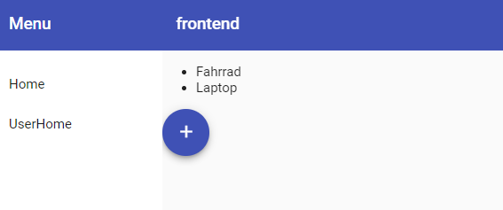

# Chapter 7

## Exercise: 7.1

### Add a button to item list

Add a mat-toolbar element to the safe-page.component.
Add a button with the 'add' icon to this toolbar.



<details><summary>Show Solution</summary>
  
- safe-page.component.html

```html
...
<mat-toolbar>
  <button *ngIf="isCustomer" mat-mini-fab color="primary">
    <mat-icon aria-label="add new Safe Items">add</mat-icon>
  </button>
</mat-toolbar>
...
```

</details>

## Exercise: 7.2

### Exercise: 7.2.1 Create the dialog and add open dialog function

Generate dialog component

```bash
ng g component views/user/containers/addSafeItemDialog --export --changeDetection OnPush --entryComponent
```

- Import MatDialogModule to shared module
- Add AddSafeItemDialogComponent to entryComponents in the user module
- Implement the addSafeItem method in safe-page.component.ts

<details><summary>safe-page.component.ts Solution</summary>

```typescript
// ...
import { MatDialog } from '@angular/material';
// ...
private dialogService: MatDialog,
// ...
addSafeItem() {
  this.dialogService.open(AddSafeItemDialogComponent);
}
```

</details>

### Exercise: 7.2.2 Create a template driven form inside a dialog


Create form component:

```bash
ng g component views/user/components/SafeItemForm --export --changeDetection OnPush
```

## write the dialog template

add-safe-item-dialog.component.html

```html
<cool-safe-item-form></cool-safe-item-form>
```

### Exercise 7.2.3 Create Form Component

- Use mat-form-field
- make sure to set autocomplete name
- add input field for item name. it is required
- add input field for price. it is required and only numbers might be used.
- use ngModel to set the input values on the dialog result object.
- implement a submit button, which is disabled as long as the form is invalid.

<details><summary>safe-item-form.component.html Solution</summary>

<p>

```html
<h1>Please insert name and price of the item</h1>
<form (ngSubmit)="onSubmit()" #safeitemForm="ngForm">
  <div>
    <mat-form-field>
      <input
        autocomplete="section-item name"
        #name="ngModel"
        matInput
        placeholder="name"
        required
        aria-required="true"
        [(ngModel)]="model.name"
        type="text"
        name="name"
        class="form-control"
        id="name"
      />
      <mat-error
        *ngIf="(name.invalid || !name.pristine) && name.getError('required')"
        >required</mat-error
      >
    </mat-form-field>
    <mat-form-field>
      <input
        autocomplete="section-item price"
        #price="ngModel"
        matInput
        required
        placeholder="price"
        pattern="[0-9]*"
        aria-required="true"
        [(ngModel)]="model.price"
        type="text"
        name="price"
        class="form-control"
        id="price"
      />
      <span matPrefix>€&nbsp;</span>
      <span matSuffix>.00</span>
      <mat-error
        *ngIf="(price.invalid || !price.pristine) && price.getError('required')"
        >required</mat-error
      >
      <mat-error *ngIf="price.invalid || !price.pristine "
        >{{price.getError('pattern') | json}}</mat-error
      >
    </mat-form-field>
    <button
      [disabled]="!safeitemForm.form.valid"
      mat-raised-button
      color="primary"
      type="submit"
    >
      Submit
    </button>
  </div>
  {{ model | json }}
</form>
```

```scss
div {
  display: flex;
  flex-direction: column;
}
```

</p>
</details>

<details><summary>safe-item-form.component.ts Solution</summary>

<p>

```typescript
import {
  Component,
  EventEmitter,
  OnInit,
  ChangeDetectionStrategy,
  Input,
  Output
} from "@angular/core";
import { SafeItem } from "~core/model";

@Component({
  selector: "cool-safe-item-form",
  templateUrl: "./safe-item-form.component.html",
  styleUrls: ["./safe-item-form.component.scss"],
  changeDetection: ChangeDetectionStrategy.OnPush
})
export class SafeItemFormComponent implements OnInit {
  @Output()
  result: EventEmitter<SafeItem> = new EventEmitter();
  model: SafeItem = {} as SafeItem;

  constructor() {}

  ngOnInit() {}

  onSubmit() {
    this.result.emit(this.model);
  }
}
```

</p>
</details>

Implement the addItem function in safe.service.ts:

Unit Tests:

```typescript
// TODO
```

```typescript
  addItem(safeId: string, item: SafeItem): any {
    if (!this.items.has(safeId)) {
      this.items.set(safeId, new BehaviorSubject<SafeItem[]>(null));
    }
    const oldItems = this.items.get(safeId).getValue();
    if (!!oldItems) {
      const newItems = [...oldItems, item];
      this.items.get(safeId).next(newItems);
    } else {
      this.items.get(safeId).next([item]);
    }
  }
```

### Exercise 7.2.4 Call the add Item Method from the safe-page.component.ts

Hint: subscribe to the afterClosed Observable of the dialogRef.

<details><summary>Show Solution</summary>

safe.component.ts

```typescript
  addSafeItem() {
    const dialogRef = this.dialogService.open(AddSafeItemDialogComponent, {
      height: '400px',
      width: '600px',
    });
    dialogRef
      .afterClosed()
      .pipe(withLatestFrom(this.safe$))
      .subscribe(([result, safe]: [SafeItem, Safe]) => {
        console.log(`Dialog result: ${result}`);
        if (result) {
          this.service.addItem(safe.id, result);
        }
      });
  }
```

</details>

### Exercise 7.2.5 Bind the form result to the dialog component

<details><summary>Show Solution</summary>

Add close function to the dialog: add-safe-item-dialog.component.ts

```typescript
export class AddSafeItemDialogComponent implements OnInit {
  constructor(public dialogRef: MatDialogRef<AddSafeItemDialogComponent>) {}

  ngOnInit() {}

  closeDialog(safeItem: SafeItem) {
    this.dialogRef.close(safeItem);
  }
}
```

add-safe-item-dialog.component.html

```html
<cool-safe-item-form (result)="closeDialog($event)"></cool-safe-item-form>
```

</details>

## Additional Exercise: add Edit SafeItem

- Implement an EditSafeItem Dialog.
- Pass a copy of safeitem to the dialog.
- Modify form to accept optional @Input.

[Next](chapter8.md)
